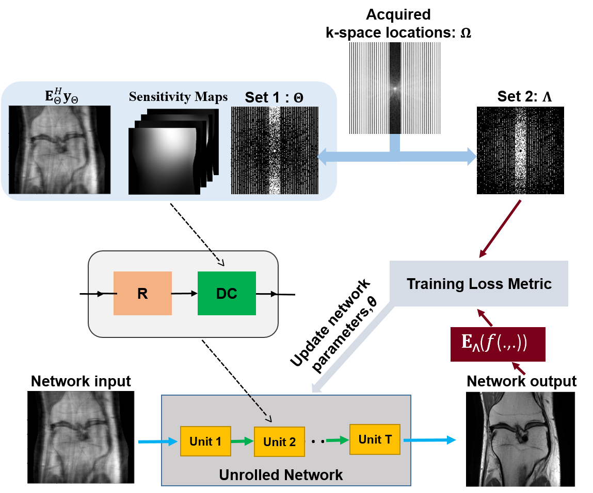
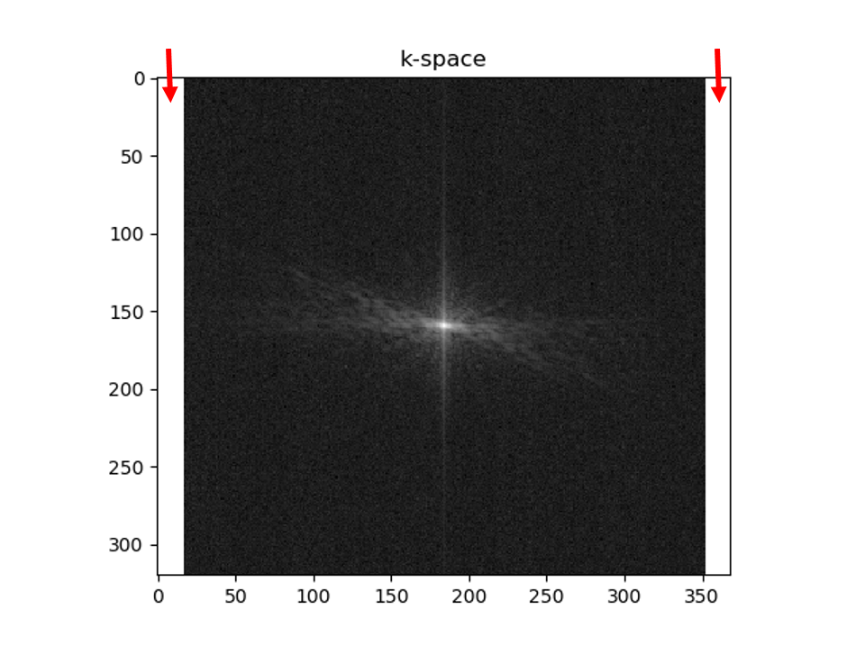

# MC-DDPM-SSL
An attempt to train MCDDPM via SSL

# Description of SSDU: Self-Supervision via Data Undersampling
SSDU enables physics-guided deep learning MRI reconstruction without fully-sampled data ([paper](https://onlinelibrary.wiley.com/doi/abs/10.1002/mrm.28378)).
Succintly, SSDU splits acquired measurements <b>Ω</b> into 2 disjoint sets, <b>Θ</b> and <b>Λ</b>.
<b>Θ</b>  is used in the data consistency units of the unrolled network and <b>Λ</b> is used to define the loss in k-space.

 <br>

*The self-supervised learning scheme to train physics-guided deep learning without fully sampled data. The acquired subsampled
k-space measurements, Ω, are split into two disjoint sets, Θ and Λ. The first set of indices, Θ, is used in the data consistency unit of the unrolled
network, whereas the latter set, Λ, is used to define the loss function for training. During training, the output of the network is transformed to
k-space, and the available subset of measurements at Λ are compared with the corresponding reconstructed k-space values. Based on this training
loss, the network parameters are subsequently updated.*


## Installation
Dependencies are given in environment.yml. A short list of the required packages to run SSDU codes are given in requirements.txt.
Requirements can be installed in an environment with
```
pip install -r requirements.txt
```
## Datasets
We have used the [fastMRI](https://fastmri.med.nyu.edu/) dataset in our experiments.

We have provided a saved model using Coronal proton density dataset. However, we recommend to retrain SSDU for fair comparisons as we can not share the dataset.

Moreover, SSDU is agnostic to CNN architecture. Hence, it should be retrained with the matching CNN for fair comparisons
## How to use
SSDU training can be performed by running `train.py` file. Prior to running training file, hyperparameters such as number of unrolled blocks, split ratio (<b>ρ</b>) for training and loss masks can be adjusted from `parser_ops.py`. `train.py` file retrieves directories of datasets (kspace, sensitivity maps and mask. Note the kspace and sensitivity maps should have size of nSlices x nrow x ncol x ncoil and mask should have size of nrow x ncol) from `get_train_directory` function defined in `utils.py` file. Users should set these directories prior to running `train.py` file.

`train.py`  file generates a test model and save them to the directory defined by user. Testing can be performed by running `test.py` file. `test.py` retrieves directories of datasets as well as  saved training model from `get_test_directory` function defined in `utils.py` file. Users should set these directories prior to running `test.py` file.

We highly recommend the users to set the outer k-space regions with no signal (see below figure) as 1 in training mask to ensure consistency with acquired measurements. This should be done for both `train.py` and `test.py` files.
 <br>
*Red arrows points at the outer k-space regions with no signal (in this example, first 17 columns and last 16 columns of k-space have no signal). These regions should be set as 1 in the train mask to ensure data consistency. For knee dataset used in our experiments, this can be done as (see lines 81-83 in `train.py` and 40-42 in `test.py`)*
```
# %%  zeropadded outer edges of k-space with no signal
if args.data_opt == 'Coronal_PD':
    trn_mask[:, :, 0:17] = np.ones((nSlices, args.nrow_GLOB, 17))
    trn_mask[:, :, 352:args.ncol_GLOB] = np.ones((nSlices, args.nrow_GLOB, 16))
```

## Citation
If you use these codes, please cite
```
@Article{yaman2020self_mrm,
   Author="Yaman, Burhaneddin and Hosseini, Seyed Amir Hossein and Moeller, Steen and Ellermann, Jutta and Ugurbil, Kamil and Akcakaya, Mehmet",
   Title="{Self-Supervised Learning of Physics-Guided Reconstruction Neural Networks without Fully-Sampled Reference Data}",
   Journal="Magnetic Resonance in Medicine",
   Year="2020",
   Volume="84",
   Number="6",
   Pages="3172--3191",
   Month="Dec"
}

@inproceedings{yaman2020self_isbi,
  title={Self-supervised physics-based deep learning MRI reconstruction without fully-sampled data},
  author={Yaman, Burhaneddin and Hosseini, Seyed Amir Hossein and Moeller, Steen and Ellermann, Jutta and Ugurbil, Kamil and Akcakaya, Mehmet},
  booktitle={ Proc. IEEE Int. Symp. Biomed. Imag. (ISBI)},
  pages={921--925},
  year={2020},
  organization={IEEE}
}
```

## Copyright & License Notice
© 2021 Regents of the University of Minnesota

SSDU is copyrighted by Regents of the University of Minnesota and covered by US 17/075,411. Regents of the University of Minnesota will license the use of SSDU solely for educational and research purposes by non-profit institutions and US government agencies only. For other proposed uses, contact umotc@umn.edu. The software may not be sold or redistributed without prior approval. One may make copies of the software for their use provided that the copies, are not sold or distributed, are used under the same terms and conditions. As unestablished research software, this code is provided on an "as is'' basis without warranty of any kind, either expressed or implied. The downloading, or executing any part of this software constitutes an implicit agreement to these terms. These terms and conditions are subject to change at any time without prior notice.

## Questions
If you have questions or issues, please open an issue or reach out to me at yaman013 at umn.edu .


# Description of MCDDPM 

## Introduction

This docs is helpful to reproduce our work MCDDPM, which has been accepted by MICCAI 2022. It includes the following parts:
1. Dataset
2. Preparation
3. Experiments

## Dataset

We use the single-coil knee data of fastmri to evaluate our MCDDPM method. The dataset can be downloaded from https://fastmri.med.nyu.edu. The data was extracted to `../datasets/fastmri/` and includes two sub-directories, `knee_singlecoil_train` and `knee_singlecoil_test`. We split the dataset into two parts, `pd` and `pdfs` for different sequences. In our experiments, we consider the acceleration factors of 4 and 8.

## Preparation

Before experiments, we generate some lists which contain fastmri data information and save them as `.pkl` files. They will be used for model training and test.

* for `pd` training

```shell
python utils/dataset_utils/gen_fastmri_data_info.py \
--data_dir ../datasets/fastmri/knee_singlecoil_train \
--data_info_dir data/fastmri \
--num_files -1 \
--num_pd_files -1 \
--num_pdfs_files 0 \
--data_info_file_name pd_train_info
```

* for `pd` test

```shell
python utils/dataset_utils/gen_fastmri_data_info.py \
--data_dir ../datasets/fastmri/knee_singlecoil_val \
--data_info_dir data/fastmri \
--num_files -1 \
--num_pd_files -1 \
--num_pdfs_files 0 \
--data_info_file_name pd_test_info
```

* for `pd` 6 file test

```shell
python utils/dataset_utils/gen_fastmri_data_info.py \
--data_dir ../datasets/fastmri/knee_singlecoil_val \
--data_info_dir data/fastmri \
--num_files -1 \
--num_pd_files 6 \
--num_pdfs_files 0 \
--data_info_file_name pd_test_6_file_info
```

* for `pdfs` training

```shell
python utils/dataset_utils/gen_fastmri_data_info.py \
--data_dir ../datasets/fastmri/knee_singlecoil_train \
--data_info_dir data/fastmri \
--num_files -1 \
--num_pd_files 0 \
--num_pdfs_files -1 \
--data_info_file_name pdfs_train_info
```

* for `pdfs` test

```shell
python utils/dataset_utils/gen_fastmri_data_info.py \
--data_dir ../datasets/fastmri/knee_singlecoil_val \
--data_info_dir data/fastmri \
--num_files -1 \
--num_pd_files 0 \
--num_pdfs_files -1 \
--data_info_file_name pdfs_test_info
```

* for `pdfs` 6 file test

```shell
python utils/dataset_utils/gen_fastmri_data_info.py \
--data_dir ../datasets/fastmri/knee_singlecoil_val \
--data_info_dir data/fastmri \
--num_files -1 \
--num_pd_files 0 \
--num_pdfs_files 6 \
--data_info_file_name pdfs_test_6_file_info
```

## Experiments

We conducted experiments of U-Net and MCDDPM. When training multiple gpus can be used, while only one gpu is used for test.

### U-Net

#### Training for U-Net
Take `pd4x` as an example.

Train for `pd4x`.

```shell
SCRIPT_FLAGS="--method_type unet \
--log_dir logs/fastmri/unet/pd4x"
DATASET_FLAGS="--dataset fastmri --data_dir ../datasets/fastmri/knee_singlecoil_train \
--data_info_list_path data/fastmri/pd_train_info.pkl \
--batch_size 16 --acceleration 4 --num_workers 6"
TRAIN_FLAGS="--microbatch 4 --log_interval 10 --save_interval 5000 --max_step 10000 \
--model_save_dir checkpoints/fastmri/unet/pd4x"

python train.py $SCRIPT_FLAGS $DATASET_FLAGS $TRAIN_FLAGS
```

We use the default model setting as shown in `utils/setting_utils/unet_setting.py`. We can add corresponding arguments to change default setting.

If train the model from last checkpoint, use argument `resume_checkpoint` and other arguments will be loaded from last checkpoint setting.

```shell
SCRIPT_FLAGS="--method_type unet \
--log_dir logs/fastmri/unet/pd4x"
TRAIN_FLAGS="--model_save_dir checkpoints/fastmri/unet/pd4x \
--resume_checkpoint model005000.pt"

python train.py $SCRIPT_FLAGS $TRAIN_FLAGS
```

When training for other data, such as `pd8x`, `pdfs4x` and `pdfs8x`, the following arguments should be specified:

1. --log_dir 
2. --data_info_list_path
3. --acceleration
4. --model_save_dir
5. --output_dir

Trained models along with other setting files will be saved in the sub-directory of `checkpoints`, which is specified by the argument `--model_save_dir`.


#### Test for U-Net

Take `pd4x` as an example and test 6 volumes. Run the following shell script to reproduce our test result for U-Net.

Test for `pd4x`.

```shell
SCRIPT_FLAGS="--method_type unet \
--log_dir logs/fastmri/unet/pd4x"
DATASET_FLAGS="--dataset fastmri --data_dir ../datasets/fastmri/knee_singlecoil_val \
--data_info_list_path data/fastmri/pd_test_6_file_info.pkl \
--acceleration 4 --num_workers 2"
TEST_FLAGS="--microbatch 10 \
--model_save_dir checkpoints/fastmri/unet/pd4x --resume_checkpoint model010000.pt \
--output_dir outputs/fastmri/unet/pd4x \
--debug_mode False"

python test.py $SCRIPT_FLAGS $DATASET_FLAGS $TEST_FLAGS
```

When test for other data, such as `pd8x`, `pdfs4x` and `pdfs8x`, the following arguments should be specified:

1. --log_dir 
2. --data_info_list_path
3. --acceleration
4. --model_save_dir
5. --output_dir

We list other shell script as follows.

Test for `pd8x`.

```shell
SCRIPT_FLAGS="--method_type unet \
--log_dir logs/fastmri/unet/pd8x"
DATASET_FLAGS="--dataset fastmri --data_dir ../datasets/fastmri/knee_singlecoil_val \
--data_info_list_path data/fastmri/pd_test_6_file_info.pkl \
--acceleration 8 --num_workers 2"
TEST_FLAGS="--microbatch 10 \
--model_save_dir checkpoints/fastmri/unet/pd8x --resume_checkpoint model010000.pt \
--output_dir outputs/fastmri/unet/pd8x \
--debug_mode False"

python test.py $SCRIPT_FLAGS $DATASET_FLAGS $TEST_FLAGS
```

Test for `pdfs4x`.

```shell
SCRIPT_FLAGS="--method_type unet \
--log_dir logs/fastmri/unet/pdfs4x"
DATASET_FLAGS="--dataset fastmri --data_dir ../datasets/fastmri/knee_singlecoil_val \
--data_info_list_path data/fastmri/pdfs_test_6_file_info.pkl \
--acceleration 4 --num_workers 2"
TEST_FLAGS="--microbatch 10 \
--model_save_dir checkpoints/fastmri/unet/pdfs4x --resume_checkpoint model010000.pt \
--output_dir outputs/fastmri/unet/pdfs4x \
--debug_mode False"

python test.py $SCRIPT_FLAGS $DATASET_FLAGS $TEST_FLAGS
```

Test for `pdfs8x`.

```shell
SCRIPT_FLAGS="--method_type unet \
--log_dir logs/fastmri/unet/pdfs8x"
DATASET_FLAGS="--dataset fastmri --data_dir ../datasets/fastmri/knee_singlecoil_val \
--data_info_list_path data/fastmri/pd_test_6_file_info.pkl \
--acceleration 8 --num_workers 2"
TEST_FLAGS="--microbatch 10 \
--model_save_dir checkpoints/fastmri/unet/pdfs8x --resume_checkpoint model010000.pt \
--output_dir outputs/fastmri/unet/pdfs8x \
--debug_mode False"

python test.py $SCRIPT_FLAGS $DATASET_FLAGS $TEST_FLAGS
```

The result of testing will be saved in the sub-directory of `outputs` which is specified by the argument `--output_dir`. The output directory contains reconstructions and evaluation metrics.

### MCDDPM

#### Training for MCDDPM
Take `pd4x` as an example.

Train for `pd4x`.

```shell
SCRIPT_FLAGS="--method_type mcddpm \
--log_dir logs/fastmri/mcddpm/pd4x"
DATASET_FLAGS="--dataset fastmri --data_dir ../datasets/fastmri/knee_singlecoil_train \
--data_info_list_path data/fastmri/pd_train_info.pkl \
--batch_size 16 --acceleration 4 --num_workers 6"
TRAIN_FLAGS="--microbatch 4 --log_interval 10 --save_interval 5000 --max_step 35000 \
--model_save_dir checkpoints/fastmri/mcddpm/pd4x"

python train.py $SCRIPT_FLAGS $DATASET_FLAGS $TRAIN_FLAGS
```

We use the default model setting, diffusion setting and schedule sampler setting as shown in `utils/setting_utils/mcddpm_setting.py`. We can add corresponding arguments to change default setting.

Trained models along with other setting files will be saved in the sub-directory of `checkpoints`, which is specified by the argument `--model_save_dir`.

If train the model from last checkpoint, use argument `resume_checkpoint` and other arguments will be loaded from last checkpoint setting.

```shell
SCRIPT_FLAGS="--method_type mcddpm \
--log_dir logs/fastmri/mcddpm/pd4x"
TRAIN_FLAGS="--model_save_dir checkpoints/fastmri/mcddpm/pd4x \
--resume_checkpoint model005000.pt"

python train.py $SCRIPT_FLAGS $TRAIN_FLAGS
```

#### Test for MCDDPM

Take `pd4x` as an example and test 6 volumes. Run the following shell script to reproduce our test result for MCDDPM.

```shell
SCRIPT_FLAGS="--method_type mcddpm \
--log_dir logs/fastmri/mcddpm/pd4x"
DATASET_FLAGS="--dataset fastmri --data_dir ../datasets/fastmri/knee_singlecoil_val \
--data_info_list_path data/fastmri/pd_test_6_file_info.pkl \
--batch_size 20 --acceleration 4 --num_workers 2"
TEST_FLAGS="--model_save_dir checkpoints/fastmri/mcddpm/pd4x --resume_checkpoint model035000.pt \
--output_dir outputs/fastmri/mcddpm/pd4x --num_samples_per_mask 20 \
--debug_mode False"

test.py $SCRIPT_FLAGS $DATASET_FLAGS $TEST_FLAGS
```

The argument `--num_samples_per_mask` is to control the number of construction for one slice. We can also add the argument `--timestep_respacing 500` to specify the sampling steps (default is 1000).

When training for other data, such as `pd8x`, `pdfs4x` and `pdfs8x`, the following arguments should be specified:

1. --log_dir 
2. --data_info_list_path
3. --acceleration
4. --model_save_dir
5. --output_dir

The specific settings for `pd8x`, `pdfs4x`, `pdfs8x` are similar to the part of U-Net above.

The result of testing will be saved in the sub-directory of `outpus` which is specified by the argument `--output_dir`. The output directory contains reconstructions and evaluation metrics.


### Trained Models

The trained models can be downloaded from https://drive.google.com/drive/folders/1cR4_6CX8tfGEHz_UytT5QbHKXSEOJOxX?usp=sharing to test the performance.
